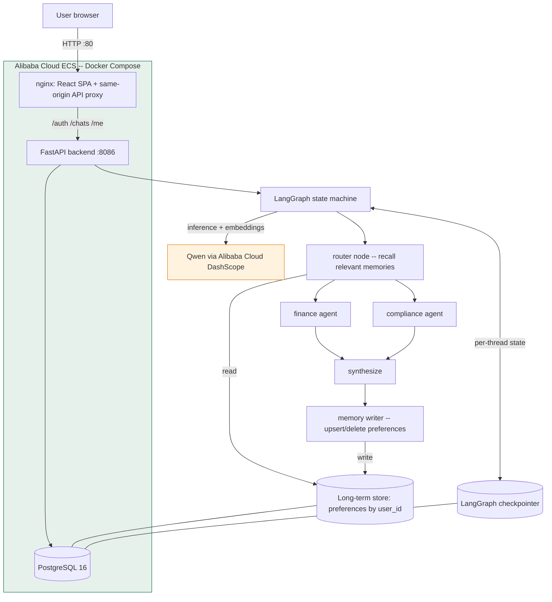

# Hikmat PSX

A finance and Shariah-compliance assistant for the Pakistan Stock Exchange (PSX) that
remembers each user across sessions and lets that memory shape the answers it gives.

Built for the Global AI Hackathon Series with Qwen Cloud — **Track 1: MemoryAgent**.

- **Live demo:** http://47.84.234.2
- **Model:** Qwen, via Alibaba Cloud DashScope
- **Backend:** Alibaba Cloud ECS

You can register with any email and password. A new account starts with empty memory, so it is
easy to watch the agent learn your preferences and then apply them in a later conversation.

## What it does

Most chatbots forget you as soon as a chat ends. For an investing assistant that is a real
problem: if you have already said you only invest in Shariah-compliant stocks, prefer answers in
Urdu, and take a conservative long-term view, you should not have to repeat that every time.

Hikmat PSX keeps a persistent memory of those preferences. It learns them from normal
conversation, drops them when you change your mind, and — importantly — uses them to change what
it recommends, not just how it talks.

## Memory design

The project separates memory into three layers so that each has a clear owner and lifetime.

| Layer | Contents | Key | Lifetime |
|-------|----------|-----|----------|
| Chat history | The Q&A shown in the UI | `chat_id + qid` | Removed when the chat is deleted |
| Per-thread context | The agent's working state for one conversation | `thread_id` (= `chat_id`) | Purged with the chat |
| Long-term memory | Durable user preferences only | `user_id` | Survives new chats and logout |

The long-term layer is what makes this a MemoryAgent: it is keyed to the user, not the
conversation, so it persists across sessions.

**Writing memory.** The agent does not save things while it answers. After each turn, a separate
reflection step ([`memory_writer_node`](app/graph/nodes.py#L307)) looks at the finished turn and
produces a short list of upsert/delete operations over a fixed set of preference keys
(`language`, `risk_tolerance`, `investment_horizon`, `preferred_sectors`, `focus_tickers`,
`reporting_currency`, `detail_level`, `shariah_only`). On an ordinary question it writes nothing.
Because this runs after the answer has streamed, it adds no delay to the response.

**Forgetting.** When a user revokes or contradicts a preference — "forget the Shariah filter",
"any sector is fine now" — the reflection step emits a delete and the preference is removed
([`app/common/memory.py`](app/common/memory.py#L79)). Deleting a chat also clears its per-thread
checkpoint history.

**Recall within a limited context.** Rather than pushing every stored preference into every
prompt, each turn selects only what is relevant ([`app/common/retrieval.py`](app/common/retrieval.py)).
Hard constraints such as language and the Shariah filter are always applied; the rest are ranked
by semantic similarity to the current question using Qwen/DashScope embeddings, and only the top
few are injected. This keeps the prompt small as memory grows, and falls back to injecting
everything if embeddings are unavailable.

## Features worth noting

- **Live memory feed.** When the agent remembers or forgets something, the chat shows an inline
  card with the key, the value, and a one-line reason. Memory changes are visible, not hidden.
- **Recall indicator.** Each answer reports how many memories were recalled out of the total,
  with similarity scores, so the limited-context recall can be inspected.
- **Shariah filter that changes behavior.** Tell it once that you only want Shariah-compliant
  stocks, and later comparisons and recommendations exclude non-compliant tickers automatically —
  for example flagging a conventional bank as non-compliant and pointing to a compliant
  alternative. This is the clearest case of stored memory altering the output.
- **Multi-agent answering.** A router sends each question to a finance agent (summaries, charts)
  and/or a compliance agent (SQL over PSX data); their answers are merged before the reflection
  step runs.

## Architecture



Each turn: the router recalls the memories relevant to the question, the specialist agents answer
using Qwen, the answers are merged and streamed, and then the memory writer reflects and updates
the user's long-term preferences.

## Qwen and Alibaba Cloud

All inference uses Qwen through the Alibaba Cloud DashScope endpoint, and the whole stack runs on
an Alibaba Cloud ECS instance.

- Qwen chat model: [`app/common/utils.py`](app/common/utils.py#L46) (`qwen` branch) and the
  runtime call in [`backend/routers/chats.py`](backend/routers/chats.py#L213).
- Qwen/DashScope embeddings for recall: [`app/common/retrieval.py`](app/common/retrieval.py#L52).
- Deployment: [`docker-compose.yml`](docker-compose.yml) (Postgres + FastAPI + nginx) on ECS.

## Tech stack

- Qwen (Alibaba Cloud DashScope) for chat and embeddings
- LangGraph for the multi-agent graph and Postgres-backed memory
- FastAPI with Server-Sent Events for streaming
- PostgreSQL 16
- React + Vite frontend
- Docker Compose on Alibaba Cloud ECS behind nginx

## Running locally

```bash
git clone https://github.com/PariBai/devpost-qwen-hackathon.git
cd devpost-qwen-hackathon
```

Create a `.env` file:

```
DASHSCOPE_API_KEY=sk-...
DASHSCOPE_BASE_URL=https://dashscope-intl.aliyuncs.com/compatible-mode/v1
QWEN_MODEL=qwen-flash
EMBED_MODEL=text-embedding-v3
POSTGRES_USER=psx_admin
POSTGRES_PASSWORD=psx_admin
POSTGRES_DB=psxmemory
JWT_SECRET=<random-hex>
```

Then:

```bash
docker compose up --build
# open http://localhost
```

The Alibaba Cloud ECS deployment uses the same command with `-d`.

## Repository layout

```
app/                 LangGraph agent core
  graph/nodes.py       router, finance/compliance, synthesize, memory writer
  common/memory.py     long-term preference store (save/get/list/delete)
  common/retrieval.py  relevance-based recall
  common/store.py      Postgres / in-memory store wiring
  tools/               finance, compliance, charts, memory tools
  prompts/             agent and memory-writer prompts
backend/             FastAPI app, auth, chat routes, SSE streaming
frontend/            React + Vite SPA
docker-compose.yml   Postgres + API + nginx (the ECS stack)
```

## License

MIT — see [LICENSE](LICENSE).
